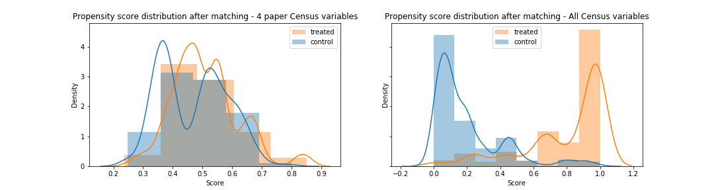

Due to the lack of random assignment to treatment groups in **observational studies**, omitted variable bias can affect treatment effect estimates. One can therefore question results of regression analyses for such studies, and **sensitivity analysis** allows to quantify the impact of potential **omitted variables**. In the paper 'Housing, Health and Happiness', the matching between treatment and control is not fully transparent, and the lack of sensitivity analysis does not allow to measure its performance. 

In this extension, we propose to conduct a robustness check to verify the matching through a sensitivity analysis for various matching methods, in order to assess the bias needed to change the results significantly. Specifically, a **similar matching as proposed in the paper** and a **propensity score matching** are studied. Finally, analysis of the regressions carried out in the paper for the different matchings can be carried out.

---------------------------

### Context
 
In the paper 'Housing, Health and Happiness', the aim is to measure the impact of replacing dirt floors with cement floors in Mexico, on health and welfare of young children and their mothers. A large-scale program called Piso Firme offered households up to 50m² of cement floor. It was established by the Mexican government in $2000$ in the State of Coahuila first, then in $2004$ in the state of Durango. The study observes the evolution of two populations in two twin cities: Gomez Palacios and Lerdo, State of Coahuila (group control) and Torreon, State of Durango (group treatment). They are geographically close but the beginning of the program implementation differ as they are in two different states. They proceded in three steps: verification that control and treatment groups are well balanced, estimation of the program impact and examination of the robustness of the results. Their verification showed that both control and treatment groups were balanced on all levels before the program. Their conclusion was that the Piso Firme program improved health and welfare of young children and their parents. The cement floors significantly reduced the number of cases of parasitic infestations, diarrhea, anemia and then improved the health and cognitive development of the children. They also increased happiness and quality of life of adults as well as decreased depression.

### I. The Problems with Observational Studies

## Randomised ? 

In an **ideal randomised trial**, the treatment assignment would be randomly decided (equivalent to a $50/50$ coin flip). Therefore, if we assume the trial is actually randomised, the distribution of our covariates will be the same in both groups, i.e. the covariates are said to be balanced. In this case, the control and treatment groups are indistinguishable. Thus, if the outcome between different treatment groups end up differing, it will not be because of differences in the covariates defining the groups, it will be because of the treatment.

However, as it is not always possible to perform a randomised trial (either unethical, impractical, too expensive, ...), **observational studies** are conducted, where there is no intervention in the treatment assignment and retrospective data is observed. This is the case of the 'Housing, Health and Happiness' paper. Indeed, data is collected from census and surveys a posteriori and the researchers cannot control the conditions under which samples are distributed. This might lead to a potential problem as the decision of which subjects receive the treatment is not entirely random and thus a potential source of bias.

To be more precise, subjects are selected to be treated and the treatment assignment and the outcome may be caused by the same hidden covariate. For observational studies, the distribution of variables will typically differ between treatment and control group, as it is not a randomised trial. The goal of the study is to determine the effects of the variables defining households before the begining of the program on the outcome, but sometimes the measured covariates may not be directly causing the differences in the outcome. There might be more covariates which were not measured but are actually important in the chain of cause and effect. These variables that affect both treatment assignment and outcome are called **confounders**, as seen on Figure 1. In observational studies, an important assumption in the estimation of causal effect is the **ignorability assumption** : given pre-treatment covariates, treatment assignment is independent of the potential outcome, also known as the "no unmeasured confounders' assumption".  

<figure>  
<figcaption>Figure 1 - Effect of confounders on treatment and outcome.</figcaption> </figure>

## Balanced ? 

We can start by analysing the distribution and properties of the variables from the $2000$ Census, which are the pre-treatment variables. In the dataset, they correspond to the variables beginning in 'C_'. Following their results given in Table 2, we can compute the mean values of treatment and control, as well as the mean difference by aggregating at census block level. In the paper, this is what they use as evidence to show that the data is balanced with their matching, so it is interesting to check these results by replicating this table. 
-> no statistical test so we apply a statistical test to check wether the variables or balanced or not

To assess whether balance is achieved between treatment and control, we can look at standardized mean differences (SMD), which is calculated by the difference in the means between the two groups divided by the pooled standard deviation : 

$\mathrm{SMD} = \frac{ \bar{\mathcal X_t} - \bar{\mathcal X_c} }{ \sqrt{(s_{t}^{2} + s_{c}^{2})/2} }$ where $\bar{\mathcal X_t}$, $\bar{\mathcal X_c}$  denote the mean of that feature for the treatment and control group respectively. We will use absolute value of this number. $s_{t}$, $s_{c}$ denote the standard deviation of that feature for the treatment and control group respectively.

We can calculate the standardized mean differences for every feature, and if our calculated SMD is $1$, then that means there's a $1$ standard deviation difference in means. After computing this measurement for all of our features, there is a rule of thumb that are commonly used to determine whether that feature is balanced or not (similar to the $0.05$ for $p$-value idea, which we can also use with a t-test) :
* $\mathrm{SMD} < 0.1$ : For a randomized trial, the smd between all of the covariates should typically fall into this bucket.
* $0.1 < \mathrm{SMD} < 0.2$ : Not necessarily balanced, but small enough that people are usually not too worried about them. Sometimes, even after performing matching, there might still be a few covariates whose smd fall under this range.
* $\mathrm{SMD} > 0.2$ : Values that are greater than this threshold are considered seriously imbalanced.

The graph below shows the $\mathrm{SMD}$ value for different variables and can clearly see that the distributions of the pre-treatment variables between treatment and control sets are not balanced for all variables. 

<iframe frameborder="no" border="0" marginwidth="0" marginheight="0" width="100%" height="500" allowfullscreen="true" src="assets/img/InitialSMD.html"></iframe>

### II. A Solution: Matching

## A) Theory and background

To solve the issue of the difference in variables distribution between control and treatment group, **matching** is performed. The idea is to match individuals in the treated group with similar individuals in the control group for the covariates. In the ideal case, we would like to find for each sample in the treatment group, an identical sample in the control group in terms of pre-treatment covariates. This is generally impossible but fortunately, finding similar sample in the control group is enough. The condition is that the two samples in the matched pair have probability of receiving the treatment is as close as possible. 
This is not an exact matching as the paired samples can be slightly diffferent but the overall distribution of each pre-treatment variable is balanced between the groups, this is known as stochastic balance. Matching is a technique that attempts to control for confounding and make an observational study more like a randomised trial. It enables a comparison of outcomes among treated and control samples to estimate the effect of the treatment and reducing the bias due to a potential confounder. Matching can be done in different ways.

## B) Replicating the paper's matching method

In the paper they use an $L_{\infty}$ norm : the pairs are created based on $4$ pre-treatment variables : 
* _C_blocksdirtfloor_ : Proportion of blocks of houses with houses that has dirt floors
* _C_HHdirtfloor_ : Proportion of households with dirt floors
* _C_child05_ : Average number of children between $0$ and $5$ years
* _C_households_ : Number of households
They are matching on the observed covariates. The idea is to minimise the $L_{\infty}$ distance to match the pairs of control and treatment data points. The $L_{\infty}$ distance is defined as the maximum of the absolute value of the differences between the variables for each pair of treatment and control blocks. We can compute the $L_{\infty}$ distance between each possible pair of treated and control data points and minimise to obtain the final matching.

In practice, we construct a bipartite graph. Each node represents a sample, treated samples are on one side of the graph and control samples are on the other side. 
The edges link one control and one treated sample, weighted with the $L_{\infty}$ norm. The aim is to minimise the norm over the matching. Thus the algorithm finds the best matched pairs such that the norm is minimum.

## C) Propensity score matching

Another of matching samples uses what is called propensity scores. We want that the two samples of the pair have the same probability to be treated. For subject $l$, the probability of being given full knowledge of the world is $\pi_{l} = \mathbb{P}(Z_{l} = 1 \mid r_{Cl}, r_{Tl}, \bold{x_{l}}, u_{l})$, with $Z_l$ the treatment assignment, $r_{Cl}$ the response if the subject is control, $r_{Tl}$ the response if the subject is treated, $\bold{x_{l}}$ the observed covariates and $u_{l}$ the unobserved covariates. Instead of matching on observed covariates directly, the idea is to reduce the information of all the pre-treatment covariates to one signle number called the propensity score. This number is computed for every samples using a logistic regression. By doing so, the samples with equal propensity score are guaranted to have equal distributions of observed variables. The samples in the same pair might not have equal $\bold{x}$ but total treatment and control groups will have the same distribution. 

In practice, we construct bipartite graph as explained above for the matching of the paper. The edges are now weighted with the difference of similarity score. The similarity is defined as $1 - $ the difference of propensity score. We want to minimise the difference of propensity score between the pairs. Equivalently we can maximise the similarity between the pairs. The algotihm find the matching that miximises the overall similarity.

The figure below illustrates the distribution of the propensity scores before and after the matching. We can see that after the matching, the distributions overlap almost perfectly. 

<figure>  </figure>

<figure>  </figure>

<iframe frameborder="no" border="0" marginwidth="0" marginheight="0" width="100%" height="500" allowfullscreen="true" src="assets/img/Pmatched4SMD.html"></iframe>

<iframe frameborder="no" border="0" marginwidth="0" marginheight="0" width="100%" height="500" allowfullscreen="true" src="assets/img/PmatchedAllSMD.html"></iframe>

### III. Sensitivity Analysis

## A) Theory and background

Matching can improve the veracity of the results. It ensures that similar samples are compared, i.e. they are similar in terms of observed variables. Nevertheless, there might be some unobserved covariates that highly differ between the two samples. In other words, a **naive model** assumes that the probability to be trated was $0.5$ inside the pairs treated-control. However, there might exists a unmeasured confouder that could unbalance this probability by favouring one sample or the other. **Sensibility analysis** allows to quantify the degree to which the naive model is wrong.  

> "In treatment-control pairs matched, the chance that the first person in pair $p$ is treated is $\theta_{p} = 0.5$ under the assumption that treatment assignment is ignorable. What if that assumption is wrong ?" Paul R. Rosenbaum, _Observation and experiment_

The intuition is that the naive model would be wrong if there exists a confouder sufficiently important to modify the probability of being treated by a huge amount. Let's be more precise. The model assumes that the odds of two similar data points (i.e. very similar observed covariates) are bounded by a factor $\Gamma$ : $ \frac{1}{\Gamma} \leq \frac{\pi_k(1 - \pi_k)}{\pi_l(1 - \pi_l)} \leq \Gamma $. For example, if $\Gamma = 3$, the odds ratio is comprised between $1/3$ and $3$, and the probabilty of being treated is comprised between $0.25$ and $0.75$. 

For each value of Gamma, we use a statistical test with the following hypotheses :
* $H_0$ : No treatment effect on the model.
* $H_1$ : A treatment effect on the model.

If the $p$-value $< 0.05$, we can reject the null hypothesis $H_0$ of no treatment effect. We start with $\Gamma = 1$ and then increase its value. Under the null hypothesis, increasing $\Gamma$ increases the $p$-value. Finding the smallest $\Gamma$ for which $p > 0.05$ corresponds to finding by how much would the probability have to depart from $0.5$ to obtain a $p$-value above $0.05$ so that the hypothesis of no treatment effect cannot be rejected. For example, if we obtain $p > 0.05$ for $\Gamma > 6$, then the odds of being treated would need to be $6$ times higher for two people with same covariates. Therefore, estimating a value for $\Gamma$ allows us to evaluate the likelihood of a potential hidden covariate and the consequence of this covariate on the results.

In practice, we use in this work the `sensitivitymv` R library and more specifically `senmv` function. This would allow us to evaluate the robustness of the model towards the bias between the paper assignment and a randomised one.

## Amplification of Sensitivity Analysis :

The question is now to discuss the possibility of existence of an unobserved covariate. Are there other unmeasured covariates that could have an impact on the outcomes of the models ?

In order to do so, we will need to go further and decompose $\Gamma$ into two parameters : $(\Lambda, \Delta)$. These parameters are defined by : $\Gamma = \frac{\Lambda \Delta + 1}{\Lambda + \Delta}$. For each value of $\Gamma$, we can draw a graph of $\Delta$ as a function of $\Lambda$.

$\Delta$ is called the shift. It represents the strength of the relationship between the unobserved covariate and the difference in outcomes within the matched
pair. $\Lambda$ is called the strength and evaluates the strength of the relationship between the unobserved covariate and the difference in probability of being assigned a treatment. Thus $\Delta$ represents more the ... whereas $\Lambda$ represents more ... . -> à éclaircir !!

unobserved covariate may be strongly related to treatment assignment, but its relationship with the outcome is thought to be weak, so Λ could be large with Δ much smaller

## B) Sensitivity analysis of the different matchings

The figure below shows the results in terms of value of $\Gamma$ for the different matchings : the matching of the paper using $L_{\infty}$ norm, a propensity score matching using all the variables of the census and a propensity score matching using only the four variables used in the paper. The displayed value of $\Gamma$ is the smallest value for which the $p$-value of the statistical test reaches the significance level of $0.05$. We can see that the propensity matching with all the variables performs overall a little bit worse than the two other matchings.

<iframe frameborder="no" border="0" marginwidth="0" marginheight="0" width="120%" height="500" allowfullscreen="true" src="assets/img/Gamma_fig.html"></iframe>

## Analysis of available data -> à changer de place ?

Check balance prior to matching with SMD for the census variables used for the matching (matching with pre-treatment variables, not with outcomes!)

## Regression Analysis

<iframe frameborder="no" border="0" marginwidth="0" marginheight="0" width="100%" height="500" allowfullscreen="true" src="assets/img/Bias_Figure_T4.html"></iframe>

<iframe frameborder="no" border="0" marginwidth="0" marginheight="0" width="100%" height="500" allowfullscreen="true" src="assets/img/Bias_Figure_T6.html"></iframe>

### IV. Conclusion

Answer the research questions :
* Most important variables in the data set in terms of predicting power for the studied models : ...
    
* Potential bias to alter the conclusions of the study :
The method of the paper is ... to small/high bias.
This method allowed us to study the robustness of the results.
This paper wasn't containing any statistical test. 

* Would propensity score matching (or another matching method) improve the accuracy of the results ?
It seems that propensity score doesn't improve the results.

### Resources 

 * [Paul R. Rosenbaum, _Design of observational studies_, Springer series in Statistics. 2010](https://www.springer.com/gp/book/9783030464042)
 
 * [Paul R. Rosenbaum, _Observation & Experiment : An Introduction to Causal Inference_, Harvard University Press, 2017](https://onlinelibrary.wiley.com/doi/full/10.1111/insr.12259)
 
 * [Paul R. Rosenbaum, _Sensitivity Analysis in Observational Studies_, Encyclopedia of Statistics in Behavioral Science (Vol.4), 2005](https://onlinelibrary.wiley.com/doi/abs/10.1002/0470013192.bsa606)
 
 * [C. A. Hosman et al., _The Sensitivity of Linear Regression Coefficients' Confidence Limits to the Omission of a Cofounder_, The Annals of Applied Statistics (Vol.4), 2010](https://arxiv.org/pdf/0905.3463.pdf)
 
 * [Paul R. Rosenbaum, _Package ‘sensitivitymv’_, 2018](https://cran.r-project.org/web/packages/sensitivitymv/sensitivitymv.pdf)

